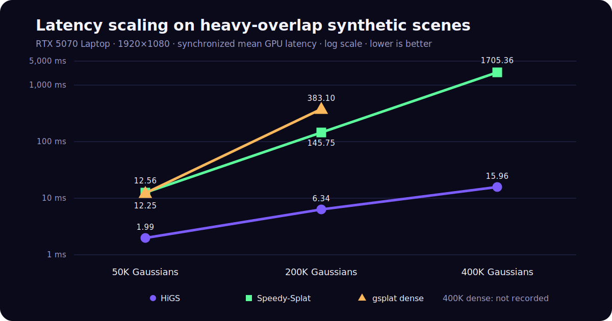

# 3DGS Renderer Evaluation Framework

[](https://github.com/caizefan34/3dgs-renderer-benchmark/actions/workflows/ci.yml)
[](https://caizefan34.github.io/3dgs-renderer-benchmark/)
[](LICENSE)
[](https://github.com/caizefan34/3dgs-renderer-benchmark/stargazers)

A quality-gated evaluation framework for CUDA 3D Gaussian Splatting renderers.
Its primary question is: **which renderer is most efficient under explicit
quality constraints?** Raw speed remains available, but it is interpreted
together with image quality, stability, memory, and scene difficulty.

[Explore the results](https://caizefan34.github.io/3dgs-renderer-benchmark/)
| [Review the protocol](#methodology)
| [Add a renderer](CONTRIBUTING.md#adding-a-renderer)

> [!IMPORTANT]
> **Synthetic speed is not quality equivalence.** Generated stress scenes have
> no GT photographs and never enter GT-quality rankings, Pareto frontiers, or
> quality-preserving recommendations.

## Benchmark taxonomy

The framework reports four deliberately separate result classes:

1. **Synthetic Stress Benchmark** — scalability, overlap, tile-list growth,
   scheduling, and memory behavior.
2. **Real Scene Quality Benchmark** — PSNR, SSIM, and LPIPS against held-out
   GT images. The current paired Train audit is renderer-fidelity verification;
   its holdout status is unverified.
3. **Real Scene Speed Benchmark** — trained scenes with identical cameras and
   resolution across renderers.
4. **Pareto Analysis** — non-dominated renderers in compatible speed-quality
   cohorts.

See the full [taxonomy](docs/benchmark_taxonomy.md),
[evaluation methodology](docs/evaluation_methodology.md),
[Synthetic Stress Suite](docs/synthetic_stress_suite.md), and
[architecture](docs/architecture.md).

## Why this benchmark

Cross-paper FPS numbers are rarely comparable. This project provides:

- real renderer adapters instead of renamed fallbacks;
- identical scene tensors and fixed camera trajectories for every renderer;
- synchronized CUDA-event latency plus separate end-to-end latency;
- GT-relative PSNR, SSIM, and LPIPS gates before a real-scene performance
  result is called quality-verified;
- machine-readable result summaries with runtime and hardware metadata;
- explicit separation of reproduced measurements from upstream claims.

## Quick start

The CPU test suite validates camera conventions, metrics, scene parsing, and
adapter contracts without requiring any optional renderer backend:

```text
git clone https://github.com/caizefan34/3dgs-renderer-benchmark.git
cd 3dgs-renderer-benchmark
python -m venv .venv
# Linux/macOS: source .venv/bin/activate
# Windows: .venv\Scripts\activate
python -m pip install -r requirements-test.txt
python -m unittest discover -s tests -v
```

For a GPU run, first install a CUDA-enabled PyTorch build that matches your
system, then install at least one backend such as `gsplat`:

```text
python -m pip install numpy gsplat
python src/scripts/generate_scene.py --gaussians 50000 --output data/scene.ply
python src/run_benchmark.py --list-renderers
python src/run_benchmark.py --scene data/scene.ply --camera-path circle --renderers gsplat --frames 100 --warmup 30 --repeats 3 --output results/quickstart
```

The standard run keeps all old output files and additionally emits
`pareto_frontier.json` and `recommendations.json`. With no GT metrics these
files contain honest exclusions/empty quality categories rather than assuming
quality equivalence.

For a compatible real-scene cohort, compute configurable experimental
effective FPS, Pareto membership, recommendations, and an HTML plot with:

```powershell
python src/scripts/analyze_results.py `
  --input data/examples/evaluation_records.json `
  --output-dir results/evaluation `
  --reference-renderer reference_renderer
```

> [!NOTE]
> CUDA extensions are sensitive to PyTorch, CUDA toolkit, compiler, and driver
> versions. Record all four when publishing a result. Windows + CUDA 13 users
> should also read [the recorded build notes](#windows--cuda-13-build).



## Verified headline

On an RTX 5070 Laptop at 1920x1080, the fastest locally timed path on the
synthetic heavy-overlap stress test is the inference-only HiGS renderer at
gsplat commit
[`77ab983`](https://github.com/nerfstudio-project/gsplat/commit/77ab983ffe43420b2131669cb35776b883ca4c3c).
These historical scenes have no source photographs, so their GT-relative
quality is **not measured**. This timing result alone does not prove that HiGS
preserves trained-scene quality.

> [!WARNING]
> The official pretrained model archive does not establish that the 38 paired
> reference photographs were excluded from training. The real-scene results
> below therefore measure renderer fidelity on fixed tensors and cameras; they
> are not a held-out reconstruction leaderboard. A previous result attributing
> a 0.626 dB drop specifically to HiGS was withdrawn after gsplat dense showed
> the same drop.

| Scene | Renderer | GPU mean | GPU median | P99 | Peak VRAM | PSNR vs GT | SSIM vs GT | LPIPS vs GT |
|---|---|---:|---:|---:|---:|---:|---:|---:|
| 50K | HiGS tile16 | 1.99 ms | 1.9 ms | 2.45 ms | 147 MB | N/A | N/A | N/A |
| 50K | Speedy-Splat | 12.56 ms | 12.5 ms | 13.82 ms | 584 MB | N/A | N/A | N/A |
| 50K | gsplat dense | 12.25 ms | 12.2 ms | 13.76 ms | 368 MB | N/A | N/A | N/A |
| 200K | HiGS tile16 | 6.34 ms | 6.3 ms | 7.23 ms | 391 MB | N/A | N/A | N/A |
| 200K | Speedy-Splat | 145.75 ms | 38.8 ms | 1934.10 ms | 2183 MB | N/A | N/A | N/A |
| 200K | gsplat dense | 383.10 ms | 50.0 ms | 876.45 ms | 1450 MB | N/A | N/A | N/A |
| 400K | HiGS tile8 | 15.96 ms | 15.8 ms | 23.22 ms | 1057 MB | N/A | N/A | N/A |
| 400K | Speedy-Splat | 1705.36 ms | 1608.9 ms | 4776.47 ms | 4276 MB | N/A | N/A | N/A |

The included generated scenes intentionally create heavy overlap. The large
Speedy/standard-gsplat tails are tied to specific camera views with very long
tile lists, rather than random timer noise.

## Paired-reference quality gate

Every renderer is compared directly with the same original photograph, never
with another renderer. Training-split provenance is reported separately.

| Renderer | Reference | PSNR | SSIM | LPIPS | Status |
|---|---|---:|---:|---:|---|
| original 3DGS | paired official Train photos | 24.9319 | 0.865773 | 0.223592 | reference |
| gsplat dense | paired official Train photos | 24.3061 | 0.858717 | 0.226278 | -0.6257 dB; not equivalent |
| TC-GS (Speedy-Splat integration) | paired official Train photos | 24.9138 | 0.865044 | 0.222874 | equivalent at configured thresholds |

The rows use the official pretrained Train model (1,071,462 Gaussians), 38
paired 980x545 photographs, and black background. The model archive's holdout
status is unverified. Exact source URLs, SHA-256 values, and the fixed image
list are in
[`official_3dgs_train_reference.json`](data/scenes/official_3dgs_train_reference.json).
The consolidated [machine-readable result](data/results/rtx5070_train_reference_summary_2026-07-14.json)
links the complete per-view reports.

A 10-frame, 5-warmup speed smoke test on the same official scene at the camera
file's native 1959x1090 resolution produced:

| Renderer | GPU mean | Median | P99 | FPS | Peak VRAM |
|---|---:|---:|---:|---:|---:|
| gsplat dense | 6.125 ms | 5.955 ms | 6.916 ms | 163.3 | 653 MB |
| TC-GS | 4.614 ms | 4.565 ms | 5.237 ms | 216.7 | 796 MB |

TC-GS reduced mean latency by 24.7% (1.33x) in this short, unlocked-clock run.

Install the quality dependencies and evaluate the same trained PLY with every
renderer. The camera file can be the `cameras.json` exported by original 3DGS;
only camera names present in the reference directory are selected.

```powershell
python -m pip install -r requirements-quality.txt
python src/scripts/validate_quality.py `
  --renderers tcgs `
  --scene path/to/model/point_cloud/iteration_30000/point_cloud.ply `
  --cameras path/to/model/cameras.json `
  --ground-truth-dir path/to/reference_images `
  --expected-image-list data/scenes/official_3dgs_train_reference_images.txt `
  --split-label "paired official references; holdout status unverified"
```

Run original 3DGS, gsplat dense, and TC-GS in their respective environments,
then compare reports that have identical scene, camera, and GT-manifest hashes.

The JSON report stores per-view and aggregate metrics, the camera/scene hashes,
every evaluated image hash, renderer versions, background, and thresholds.
PSNR is the mean of per-view PSNR values. SSIM matches Graphdeco's zero-padded
11x11 Gaussian implementation. LPIPS uses the PyPI VGG implementation with
inputs mapped to `[-1, 1]`; it is not labeled as Graphdeco's bundled LPIPS.

### Renderer consistency diagnostics

Historical renderer-to-renderer checks remain useful for finding rasterizer
regressions, but are not reconstruction-quality evidence: Speedy-Splat vs
gsplat dense reached minimum 111.96 dB / 1.0000 SSIM at 50K; HiGS vs gsplat
dense reached minimum 59.37 / 58.80 / 59.45 dB and 0.9997 SSIM at
50K / 200K / 400K. They must not be placed in the GT quality columns above.

## Implemented adapters

- `speedy_splat`: Speedy-Splat with static activation and fixed buffers.
- `speedy_splat_raw`: uncached wrapper ablation.
- `original_3dgs`: original graphdeco-inria diff-gaussian rasterizer (also
  available under the legacy name `diff_gaussian`).
- `gsplat`: real `gsplat.rasterization(..., packed=True)`.
- `gsplat_dense`: real `gsplat.rasterization(..., packed=False)`.
- `gsplat_higs`: HiGS inference, tile 8, uncompressed SH.
- `gsplat_higs_tile16`: HiGS inference, tile 16.
- `gsplat_higs_sh32` / `gsplat_higs_sh16`: SH packing ablations.
- `gsplat_higs_auto`: locally calibrated scale-aware configuration.
- `tcgs`: official 3DGSTensorCore Speedy-Splat integration, installed in an
  isolated environment because its upstream package name conflicts with 3DGS.
- `fast_gauss`: registered but unavailable locally because EGL loading is
  blocked by the current Windows environment/application policy.

TC-GS is pinned to the official source at
[`DeepLink-org/3DGSTensorCore`](https://github.com/DeepLink-org/3DGSTensorCore/commit/0bb82f88fde211c34b42e1497f0fc7265461592b).
The local adapter, SM 12.0 Windows build, 38-view audit, and speed smoke test
are complete. Results use the label **TC-GS (Speedy-Splat integration)** rather
than implying an unrelated rasterizer.

See [the renderer survey](docs/renderer_survey.md) for upstream commits, paper
claims, and reproducibility status.

## Correctness fixes

The previous repository results are not comparable with the verified table.
Before measurement, this work corrected:

- fake gsplat and TC-GS comparisons that actually called diff-gaussian;
- log-scales passed without `exp` activation;
- camera paths facing away from the scene;
- reversed full projection matrix multiplication;
- non-standard SH PLY property naming, while preserving legacy loading;
- a documented but unimplemented GPU clock-lock claim;
- mixed CPU/GPU timing without separate end-to-end metrics;
- missing renderer runtime version and source metadata.

## Methodology

The formulas and deterministic recommendation rules are specified in
[Evaluation methodology](docs/evaluation_methodology.md). New additive fields
include a versioned 0–10 Scene Difficulty Score, coefficient of variation,
`median/P99` stability score, quality factor, and experimental effective FPS.
Missing quality remains `null`.

- Corrected fixed camera paths use +Z facing the scene.
- Camera validation rejects paths placing the scene center behind the camera.
- Static scene packing and activation occur before timing.
- Every measured frame uses CUDA start/end events and synchronizes after the
  end event. Synchronization is outside the GPU event interval and avoids deep
  WDDM queues.
- GPU and end-to-end latency are exported separately with percentiles and VRAM.
- Raw latency standard deviation, CV, and stability score are exported without
  changing the existing jitter field.
- A real-scene result is quality-verified only after finite-output,
  camera-change, and GT-relative PSNR/SSIM/LPIPS checks pass. Synthetic timing
  results are labeled separately.

Attach independently measured scene factors with
`--difficulty-metrics data/examples/difficulty_metrics.json`; if they are not
available, `difficulty_score` remains `null` rather than being guessed from
Gaussian count.

Example:

```powershell
python src/run_benchmark.py `
  --scene data/scene.ply `
  --camera-path circle `
  --renderers gsplat_higs gsplat_higs_tile16 speedy_splat gsplat_dense `
  --frames 100 --warmup 30 --repeats 3 `
  --output results/verified/example
```

## Optimization findings

HiGS separates coarse macro-tile partitioning from fine rasterization and uses
a persistent packed inference scene. It attacks the measured bottleneck: long,
imbalanced tile-Gaussian lists and redundant work in dense views.

Tile size is workload-dependent:

- 50K: tile16 is about 15% faster than tile8.
- 200K: tile16 is about 19% faster than tile8.
- 400K: tile8 is about 21% faster than tile16.

Larger tiles reduce partition/scheduling overhead at low density. Finer tiles
reduce overdraw and load imbalance at high density. `gsplat_higs_auto` uses the
local rule `<300K -> tile16`, otherwise tile8 + SH32. This is a local heuristic,
not a universal threshold.

SH packing trades decode work for bandwidth:

- SH32 preserves high quality (minimum 64.85 dB against uncompressed HiGS).
- SH16 has a larger error (minimum 49.79 dB).
- At 50K, SH decode overhead hurts performance.
- At 400K, SH32 leaves mean latency roughly unchanged but improved P99 in one
  controlled run from 24.31 ms to 17.31 ms.

The previous claim that Python buffer reuse alone adds 7.5% was not reproduced.
Wrapper ordering varied by several percent, so it is not presented as a stable
speedup.

## Windows + CUDA 13 build

Validated gsplat commit:
`77ab983ffe43420b2131669cb35776b883ca4c3c`.

Apply the recorded Windows/CUDA13 fixes:

```powershell
git -C path/to/gsplat apply `
  path/to/3dgs-renderer-benchmark/third_party_patches/gsplat-windows-cuda13.patch
```

For an RGB-only benchmark, these upstream-supported build variables avoid
unrelated template instantiations:

```text
NUM_CHANNELS=3
BUILD_3DGS=1
BUILD_2DGS=0
BUILD_3DGUT=0
BUILD_ADAM=0
BUILD_RELOC=0
BUILD_LOSSES=0
```

TC-GS commit `0bb82f88` needs the recorded Windows/CUDA 13/SM 12.0 patch:

```powershell
git -C path/to/3DGSTensorCore apply `
  path/to/3dgs-renderer-benchmark/third_party_patches/tcgs-windows-cuda13-sm120.patch
$env:TORCH_CUDA_ARCH_LIST = "12.0"
```

Install TC-GS in an isolated environment because upstream uses the conflicting
`diff_gaussian_rasterization` package name.

## Limitations

- Historical 1920x1080 stress numbers use generated scenes. The official Train
  paired-reference audit is 980x545, while the real-scene speed smoke test uses
  the camera file's native 1959x1090 resolution.
- The official pretrained model archive's training split is unverified, so the
  paired photographs cannot be claimed as held-out for reconstruction quality.
- GPU clocks are not locked on this WDDM laptop.
- HiGS is inference-only and uses packed/fp16 internals.
- FlashGS, Local-GS, GEMM-GS, and fast-gaussian remain candidates until they
  pass the same local quality/timing protocol.
- Cross-paper speedup claims are not leaderboard results.

The headline measurements and environment metadata are also available as a
[machine-readable JSON summary](data/results/rtx5070_laptop_2026-07-13.json).

## Tests

```powershell
python -m unittest discover -s tests -v
python -m compileall -q src tests
```

Contributions are welcome; see [CONTRIBUTING.md](CONTRIBUTING.md), especially
the evidence required for new renderer results. See [CITATION.cff](CITATION.cff)
for citation metadata. The benchmark code is MIT licensed; upstream renderers
retain their own licenses.
