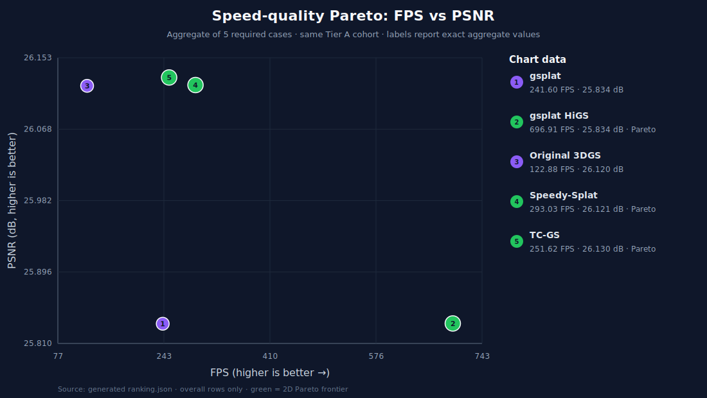

# Which 3D Gaussian Splatting renderer should I use?

[](https://github.com/caizefan34/3dgs-renderer-benchmark/actions/workflows/ci.yml)
[](LICENSE)

Use the fastest renderer that preserves the quality, memory, platform, and startup characteristics your application needs.
This repository measures those trade-offs on identical scenes, cameras, checkpoints, resolution, hardware, and protocol.

## Comparison summary

**Current scientific result: no renderer is eligible for an overall Matrix v2 recommendation yet.**

The committed legacy measurements use incompatible workloads or incomplete provenance.
They remain auditable, but they are not combined into a ranking.
The first official recommendation will appear only after at least the reference renderer and one candidate complete all five canonical cases with coupled speed and GT quality.



| Use case | Current recommendation | Rule once Tier A data exists |
| --- | --- | --- |
| Highest FPS | Not yet measured | Fastest full-suite renderer passing the quality gate |
| Highest quality | Not yet measured | Best PSNR/SSIM/LPIPS for the target case |
| Low VRAM | Not yet measured | Lowest peak process VRAM within declared quality loss |
| Web viewer | No verified web adapter | Tier A WebGPU/WebGL renderer only |
| Research | Original 3DGS as reference, not winner | Reference plus deterministic raw-output adapters |
| Production | Not yet measured | Pareto renderer meeting platform, stability, startup, and memory limits |

Tier A measured results are preferred over Tier B reproductions, which are preferred over Tier C paper values.
These evidence classes never share a ranking table.

## Run the benchmark locally

```text
python -m pip install -r requirements-benchmark.txt
python -m pip install -e .
benchmark list renderers
benchmark list datasets
benchmark prepare mipnerf360 --scene garden
benchmark prepare-case small-garden-1080p
benchmark run all
benchmark run gsplat
benchmark run --dataset garden
benchmark report
```

From a checkout without installation, replace `benchmark` with `python benchmark.py`.

`benchmark run` launches each renderer/case in an isolated process and writes:

```text
results/measured/<renderer>/<dataset>/<scene>/<run-id>/
  metrics.json
  raw_samples.json
  <renderer>/speed/benchmark_results.json
  <renderer>/quality/quality_gt.json
```

`prepare` verifies every checksum published by the source and records a local SHA-256.
Mip-NeRF 360 uses generation-pinned GCS objects with size, MD5, and CRC32C; the official Graphdeco T&T bundle uses its pinned SHA-256.
`prepare-case` selectively reads the official iteration-30000 checkpoint, builds the fixed 100-camera center-cropped trajectory, and refuses to stage files unless checkpoint, camera, and GT hashes match suite v3.1.0.
Maintainers may run `prepare-case CASE --audit-only` to recompute candidates from remote ZIP members, but audit-only output cannot enter Tier A.

## What is measured?

| Category | Metrics |
| --- | --- |
| Performance | FPS, mean/P95/P99 frame time, peak VRAM, startup, scene load, renderer preparation, time to first frame |
| Quality | PSNR, SSIM, LPIPS on the same ordered evaluation cameras |
| Environment | GPU/UUID/VRAM, driver, CUDA, CPU, RAM, OS, Python, PyTorch, renderer and benchmark commits |
| Compatibility | Features, API/backend, platforms, renderer configuration |

The primary `common_representation` track passes the same hashed PLY checkpoint to every renderer.
Pruning, retraining, or approximation belongs to a separate native track.

## Standard suite

| Workload | Scene |
| --- | --- |
| Small | Garden |
| Medium | Truck, Train |
| Large | Bicycle, Bonsai |

All primary cases use 1920×1080, the same ordered GT camera manifest, one protocol hash, and one hardware cohort per ranking.
720p and 4K are separate scaling tracks.

## Rankings and Pareto analysis

`benchmark report` generates:

- `ranking.json`;
- `ranking.csv`;
- `ranking.md`;
- measured/reproduced/paper FPS–PSNR SVG charts;
- measured/reproduced/paper FPS–LPIPS SVG charts.

Overall rows require all five cases.
The report includes real-time, PSNR, SSIM, LPIPS, efficiency, memory, and separate 2D/combined Pareto rankings.

## Supported renderer paths

Automatic adapters currently exist for original 3DGS, gsplat, gsplat HiGS modes, Speedy-Splat, and TC-GS.
fast-gaussian-rasterization needs a validated EGL environment.
FlashGS, Local-GS, GEMM-GS, and StopThePop still require custom or separate-track integration.

See [renderer integration and gap analysis](docs/renderer-integration.md) and the machine-readable [renderer specifications](benchmark/renderers.json).

## Documentation

- [Methodology](docs/methodology.md)
- [Ranking design](docs/ranking.md)
- [Datasets](docs/datasets.md)
- [Hardware cohorts](docs/hardware.md)
- [Repository architecture](docs/repository-architecture.md)
- [Migration plan](docs/migration.md)
- [Contributing](CONTRIBUTING.md)

Benchmark credibility is prioritized over the number of rows.
Missing values remain missing, incompatible evidence remains separate, and no paper number is promoted into measured data.
