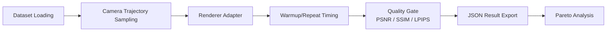

# 3DGS Renderer Evaluation Framework

[](https://github.com/caizefan34/3dgs-renderer-benchmark/actions/workflows/ci.yml)
[](https://caizefan34.github.io/3dgs-renderer-benchmark/)
[](LICENSE)

Research-grade, quality-gated benchmarking for CUDA 3D Gaussian Splatting
renderers. The platform asks which renderer is most efficient under explicit
quality constraints, not merely which renderer is fastest on one workload.

Synthetic stress results, real-scene quality results, real-scene speed results,
and Pareto analysis are kept separate. Synthetic speed is never treated as
ground-truth quality evidence.

## Why This Benchmark?

3DGS renderer evaluations often report the fastest favorable scene while
changing Gaussian count, camera path, resolution, or image quality. A renderer
can increase FPS by pruning visible Gaussians, approximating spherical
harmonics, or changing compositing order; the resulting speedup is not useful
if it silently degrades the image. Mean latency alone also hides long-tail
stalls, and peak memory is frequently omitted even though it determines which
scenes can run on a target GPU.

This benchmark treats speed as valid only within a declared quality envelope.
Every comparable run fixes the scene, camera sequence, resolution, warmup,
measurement boundary, and software environment. PSNR, SSIM, and LPIPS gates
reject outputs that do not meet the configured reference quality. Raw JSON
artifacts remain the source of truth, so leaderboard and Pareto results can be
audited or regenerated.

## Architecture



The strict adapter contract is defined in `src/adapters/base.py`. Benchmark
Protocol v1.0 is specified in [docs/protocol.md](docs/protocol.md).

## Project Overview

The benchmark platform provides:

- isolated renderer adapters for gsplat, HiGS, Speedy-Splat, original 3DGS,
  TC-GS, and registered experimental renderers;
- fixed scenes, camera trajectories, timing protocol, and reproducibility
  metadata;
- official-dataset training policy for quality-bearing benchmark submissions;
- PSNR, SSIM, and LPIPS quality gates for real-scene validation;
- Scene Difficulty Score, stability metrics, effective FPS, Pareto analysis,
  and deterministic recommendations as additive metrics;
- generated leaderboard artifacts, schema validation, regression checks,
  Docker scaffolding, and GitHub Pages outputs.

## Key Results

The table combines only committed artifacts. Performance values marked 1080p
come from the 50K-Gaussian synthetic stress cohort at 1920x1080. Quality values
come from the paired official Train reference audit and therefore describe
renderer fidelity, not held-out reconstruction quality. A dash means that no
compatible committed measurement exists.

<!-- markdownlint-disable MD013 -->

| Renderer Name | Average FPS (1080p) | Peak GPU Memory (MB) | PSNR (dB) | SSIM | LPIPS |
| --- | ---: | ---: | ---: | ---: | ---: |
| HiGS tile16 | 502.7 | 147 | 24.3047 | 0.858592 | 0.225616 |
| Speedy-Splat | 79.6 | 584 | 24.9311 | 0.865762 | 0.223610 |
| gsplat dense | 81.6 | 368 | 24.3061 | 0.858717 | 0.226278 |
| original 3DGS | — | — | 24.9319 | 0.865773 | 0.223592 |
| TC-GS | — | — | 24.9138 | 0.865044 | 0.222874 |

<!-- markdownlint-enable MD013 -->

> **Note:** Original 3DGS and TC-GS 1080p performance cells remain
> placeholders because their committed speed smoke test used 1959x1090.
> Generate comparable rows with `src/run_benchmark.py` at 1920x1080 and use
> the same 50K scene and camera manifest as the synthetic cohort.

Synthetic stress timing on an RTX 5070 Laptop at 1920x1080:

| Scene | Renderer | GPU mean | P99 | FPS | Peak VRAM | GT quality |
| --- | --- | ---: | ---: | ---: | ---: | --- |
| 50K | HiGS tile16 | 1.99 ms | 2.45 ms | 502.7 | 147 MB | N/A |
| 200K | HiGS tile16 | 6.34 ms | 7.23 ms | 157.8 | 391 MB | N/A |
| 400K | HiGS tile8 | 15.96 ms | 23.22 ms | 62.7 | 1057 MB | N/A |

Paired-reference quality audit on the official Train model:

| Renderer | PSNR | SSIM | LPIPS | Status |
| --- | ---: | ---: | ---: | --- |
| original 3DGS | 24.9319 | 0.865773 | 0.223592 | reference |
| Speedy-Splat | 24.9311 | 0.865762 | 0.223610 | audited |
| gsplat dense | 24.3061 | 0.858717 | 0.226278 | -0.6257 dB; not equivalent |
| HiGS tile16 | 24.3047 | 0.858592 | 0.225616 | -0.6272 dB; not equivalent |
| TC-GS | 24.9138 | 0.865044 | 0.222874 | equivalent at configured thresholds |

The pretrained model archive does not prove that those 38 reference images
were excluded from training, so these are renderer-fidelity results rather
than a held-out reconstruction leaderboard.

The HiGS and Speedy-Splat audit artifacts are committed under `data/results`
with the date `2026-07-15` and contain all 38 per-view measurements.

Mip-NeRF 360 speed scaling on the same RTX 5070 Laptop:

| Scene | Renderer | 720p FPS | 1080p FPS | 4K FPS |
| --- | --- | ---: | ---: | ---: |
| garden | HiGS Auto | 258.7 | 236.5 | 139.9 |
| garden | Speedy-Splat | 71.2 | 61.9 | 38.7 |
| bicycle | HiGS Auto | 255.6 | 245.9 | 124.8 |
| bicycle | Speedy-Splat | 76.2 | 56.3 | 39.7 |
| room | HiGS Auto | 870.6 | 489.8 | 318.9 |
| room | Speedy-Splat | 277.5 | 176.4 | 89.7 |

Each point uses 10 warmup frames and 30 measured frames across three repeats.
The runs used Python 3.10 and PyTorch 2.12.1+cu130; PyTorch 2.1 cannot target
the RTX 5070's `sm_120` architecture. See the
[validated scaling data](data/results/mipnerf360_resolution_scaling_2026-07-15.json)
and [resolution scaling plot](data/results/mipnerf360_resolution_scaling_2026-07-15.png).

## Quick Start

```text
git clone https://github.com/caizefan34/3dgs-renderer-benchmark.git
cd 3dgs-renderer-benchmark
python -m venv .venv
# Windows: .venv\Scripts\activate
# Linux/macOS: source .venv/bin/activate
python -m pip install -r requirements-test.txt
python -m unittest discover -s tests -v
```

GPU smoke test after installing a CUDA-enabled PyTorch build and at least one
renderer backend:

```bash
python src/scripts/generate_scene.py --gaussians 50000 --output data/scene.ply
python src/run_benchmark.py --list-renderers
python src/run_benchmark.py \
  --scene data/scene.ply --camera-path circle --renderers gsplat \
  --resolution 1080p --frames 100 --warmup 30 --repeats 3 \
  --output results/quickstart
```

Generate a paired-reference quality row for a missing renderer:

```bash
python src/scripts/validate_quality.py \
  --renderers speedy_splat --scene SCENE.ply --cameras CAMERAS.json \
  --ground-truth-dir IMAGES --output results/speedy_splat_quality.json
```

Generate leaderboards from committed benchmark JSON:

```bash
python src/scripts/generate_leaderboard.py \
  --inputs data/results/rtx5070_laptop_2026-07-13.json \
  data/results/rtx5070_train_reference_summary_2026-07-14.json \
  --output-dir results/leaderboard
```

Official rankings now accept only hash-validated cases declared in
`benchmark_suite/suite.json`. Run an official speed case with fixed cameras,
resolution, warmup, frame count, and repeats:

```bash
python src/scripts/validate_benchmark_suite.py --scene garden
python src/run_benchmark.py \
  --suite-scene garden --resolution 1080p \
  --renderers gsplat gsplat_higs_auto \
  --output results/garden_1080p
```

Generate quality measurements at the same suite resolution, then pass both
JSON files to the leaderboard generator. It joins them only when suite,
dataset, scene, camera, resolution, and GPU identities match:

```bash
python src/scripts/validate_quality.py \
  --suite-scene garden --resolution 1080p \
  --ground-truth-dir DATASET_IMAGES \
  --renderers gsplat gsplat_higs_auto \
  --output results/garden_1080p/quality.json

python src/scripts/generate_leaderboard.py \
  --inputs results/garden_1080p/benchmark_results.json \
           results/garden_1080p/quality.json \
  --output-dir results/leaderboard
```

The generated artifacts include Fastest @ PSNR >= 30/31/32, Pareto-optimal
renderers, a quality-adjusted FPS efficiency score, and `quality_speed.html`.

List official training dataset sources:

```text
python src/scripts/download_datasets.py --list-official
python src/scripts/validate_official_training.py
```

Run local renderer availability plus speed/quality suite on an official scene:

```text
python src/scripts/run_local_renderer_suite.py \
  --scene data/official/mipnerf360/garden/point_cloud.ply \
  --cameras data/official/mipnerf360/garden/cameras.json \
  --ground-truth-dir data/official/mipnerf360/garden/images \
  --renderers all \
  --output-dir results/local_renderer_suite
```

Unavailable renderer backends are reported as skipped; metrics are generated
only for adapters that actually run locally.

## Leaderboard

Committed GitHub Pages artifacts live in [`docs/leaderboard`](docs/leaderboard).
Local generated artifacts should be written to `results/leaderboard`.

The generator produces:

- `leaderboard.json`
- `leaderboard.md`
- `leaderboard.html`

See [leaderboard documentation](docs/leaderboard.md).

## Supported Renderers

- `speedy_splat`
- `original_3dgs` / `diff_gaussian`
- `gsplat`
- `gsplat_dense`
- `gsplat_higs`
- `gsplat_higs_tile16`
- `gsplat_higs_sh32`
- `gsplat_higs_sh16`
- `gsplat_higs_auto`
- `tcgs`
- `fast_gauss` (registered, unavailable in the current local Windows policy)

Renderer source, commit, and reproducibility notes are tracked in
[the renderer survey](docs/renderer_survey.md).

## Documentation Links

- [Benchmark taxonomy](docs/benchmark_taxonomy.md)
- [Methodology](docs/methodology.md)
- [Evaluation formulas](docs/evaluation_methodology.md)
- [Benchmark suite](docs/benchmark_suite.md)
- [Official dataset training](docs/official_dataset_training.md)
- [Renderer discovery](docs/renderer_discovery.md)
- [Synthetic Stress Suite](docs/synthetic_stress_suite.md)
- [Leaderboard pipeline](docs/leaderboard.md)
- [Reproducibility](docs/reproducibility.md)
- [Architecture](docs/architecture.md)
- [Benchmark Protocol v1.0](docs/protocol.md)
- [How to add a new renderer](docs/adding-a-renderer.md)
- [Research extensions](docs/research_extensions.md)
- [Summary report](docs/summary_report.md)
- [Contributing](CONTRIBUTING.md)

## FAQ

### Why Is a Renderer Missing From the Quality-Gated Leaderboard?

The backend may be unavailable on the measurement host, or it may lack a
paired-reference quality artifact. An unavailable value remains a placeholder
until a reproducible JSON result is submitted; it is never inferred from a
paper or a different workload.

### Can Results From Different GPUs or Scenes Be Compared?

They may be displayed as separate evidence, but they must not share a ranking.
Comparable rows require the same GPU cohort, checkpoint, camera manifest,
resolution, timing protocol, and quality reference.

### Why Are Warmup Frames Excluded?

Initial calls may compile kernels, allocate caches, and raise GPU clocks. The
fixed warmup phase stabilizes those effects before measurement while retaining
all required steady-state per-frame work inside the timing boundary.

### What Happens When a Renderer Fails a Quality Gate?

Its raw diagnostic timing remains available, but it is excluded from the
quality-gated leaderboard and Pareto frontier. The report records every failed
threshold so the rejection is auditable.

### How Are Out-of-Memory Failures Handled?

Each renderer is isolated, references are released, and the CUDA cache is
cleared between cases. An OOM is reported as a failed or skipped run with no
fabricated metrics.
