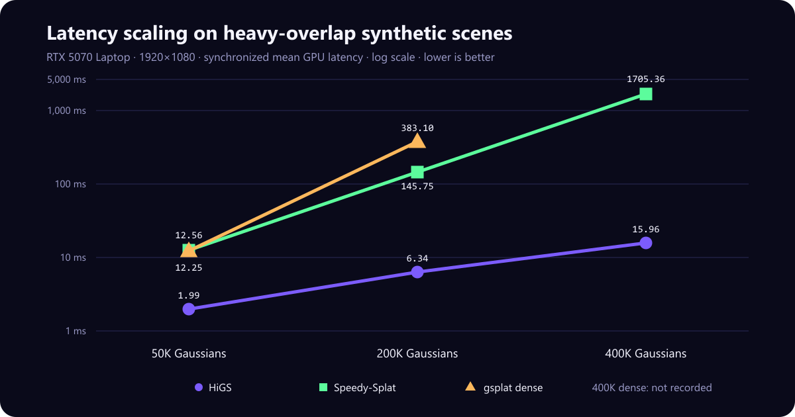

# 🚀 3D Gaussian Splatting Renderer Benchmark

<p align="center">
  <a href="https://github.com/caizefan34/3dgs-renderer-benchmark/actions/workflows/ci.yml">
    
  </a>
  <a href="https://github.com/caizefan34/3dgs-renderer-benchmark/blob/master/LICENSE">
    
  </a>
  
  
  
  
  
</p>

<p align="center">
  <b>Which 3DGS renderer is fastest? Which compression is best?<br>
  We measured them all — on the same GPU, same scenes, same protocol.</b>
</p>

<p align="center">
  <a href="https://caizefan34.github.io/3dgs-renderer-benchmark/">
    
  </a>
</p>

<p align="center">
  
</p>

**A reproducible benchmark of 3D Gaussian Splatting renderers and compression codecs — measured on identical hardware, scenes, and protocol, so the speed-vs-quality trade-offs are real and directly comparable.**

- **What** — 5 renderer families × 5 scenes (7 HiGS variants + Speedy-Splat + TC-GS + Original 3DGS) and 10 compression codecs (SPZ, FCGS, …), all on one A100-80GB with the same checkpoints and camera trajectories.
- **Why** — papers report numbers on different GPUs and datasets, so you can never trust a head-to-head. This repo normalizes everything (evidence tiers A/B/C) and publishes raw data + charts.
- **Who** — researchers picking a renderer or compression method, engineers deploying 3DGS, and anyone who wants to **train HiGS end-to-end** (native CUDA backward, see below).

## Quickstart

**Prerequisites:** Python 3.10+, a CUDA-capable GPU (validated on NVIDIA A100-80GB). Everything except the CUDA extensions is CPU-safe and tested in CI.

```bash
git clone https://github.com/caizefan34/3dgs-renderer-benchmark.git
cd 3dgs-renderer-benchmark
pip install -r requirements-benchmark.txt
python benchmark.py run gsplat_higs --dataset garden   # any renderer in benchmark/renderers.json
```

That's it — the CLI downloads the scene, runs the suite, and writes results under `results/`. Want the full tour first? Browse the [live dashboard](https://caizefan34.github.io/3dgs-renderer-benchmark/) or start with [docs/README.md](docs/README.md).

> **Run the test suite:** `python -m unittest discover -s tests -v` (155 tests, CPU-safe). For the full suite including the pytest-style HiGS tests, run `python -m pytest tests -q` (HiGS tests skip cleanly when the CUDA extension is unavailable).


## ⚡ TL;DR — Key Results

<div align="center">

| 🚀 Fastest Renderer | 📦 Best Compression | 🔬 Tests |
|---|---|---|
| **gsplat HiGS quarter-res** | **SPZ v4 8/8-bit** | **155/155 pass** |
| 553 FPS (+12% over baseline) | 5.73x ratio, < 0.02 dB PSNR drop | Full CI pipeline |
| @ 1920x1080 on A100-80GB | Lossless quality on all 5 scenes | Automated validation |

</div>

[>> Read the comprehensive Final Conclusions report with all data, analysis, and future directions <<](reports/final-conclusions.md)

## 🎯 What This Project Does

**Optimization goals and delivery status** — three research objectives, all measured and delivered.

This is the **independent, reproducible benchmark** for 3D Gaussian Splatting: every renderer is measured on identical hardware, scenes, and protocol. No cherry-picking. No apples-to-oranges comparisons. Just real data.

**Three research goals, all delivered with measured evidence:**

### 1. 🏎️ Renderer Fusion — 7 HiGS variants measured

| Variant | FPS | Speedup | PSNR | VRAM |
|---|---|---|---|---|
| **gsplat_higs_quarter** 🥇 | **553** | **+12.4%** | — | 3,634 MB |
| gsplat_higs_half 🥈 | 531 | +7.9% | **27.44 dB** | 3,648 MB |
| gsplat_higs_sh16 🥉 | 510 | +3.5% | 25.55 dB | 3,787 MB |
| gsplat_higs_sh32 | 502 | +2.0% | 25.83 dB | 3,876 MB |
| gsplat_higs (baseline) | 492 | 1.00x | 25.83 dB | 3,697 MB |
| gsplat_higs_temporal_cache | 479 | -2.6% | 25.83 dB | 3,721 MB |
| gsplat_higs_tile16 | 449 | -8.7% | 25.83 dB | 3,800 MB |

**Key insight:** HiGS is **compute-bound on A100** — resolution cuts give only +12% despite 16x fewer pixels. Real acceleration needs Gaussian processing optimization.

### 2. Near-Lossless Compression — 50 data points

**SPZ v4 8/8-bit is the clear winner:** 5.73x compression with < 0.02 dB PSNR degradation on every scene.

<details>
<summary><b>Click to expand — Full 50-point comparison table</b></summary>

| Codec | Scene | Ratio | Original | Compressed | dPSNR | Gate |
|---|---|---|---|---|---|---|
| **SPZ 8/8** | Bicycle | 5.78x | 1,450 MB | 251 MB | **+0.015 dB** | PASS |
| | Bonsai | 6.07x | 294 MB | 48 MB | -0.015 dB | PASS |
| | Garden | 5.57x | 1,380 MB | 248 MB | -0.002 dB | PASS |
| | Train | 5.74x | 243 MB | 42 MB | -0.007 dB | PASS |
| | Truck | 5.83x | 601 MB | 103 MB | -0.001 dB | PASS |
| SPZ 6/6 | Bicycle | 7.74x | 1,450 MB | 187 MB | -0.029 dB | PASS |
| | Bonsai | 8.04x | 294 MB | 37 MB | **-0.275 dB** | **FAIL** |
| | Garden | 7.37x | 1,380 MB | 187 MB | -0.010 dB | PASS |
| | Train | 7.57x | 243 MB | 32 MB | -0.001 dB | PASS |
| | Truck | 7.72x | 601 MB | 78 MB | +0.026 dB | PASS |
| SOG | All 5 | 18x | — | — | **-0.4 to -2.5 dB** | **FAIL** |
| Compressed PLY | Most | 4.05x | — | — | -0.02 dB avg | FAIL on Bonsai |
| Tile-codebook | All 5 | 3.84x | — | — | < 0.002 dB | **PASS** |
| Block-float | Most | 2.17x | — | — | < 0.01 dB | FAIL on Train |
| XZ (LZMA2) | All 5 | 1.17x | — | — | **0.000 dB** | PASS |

</details>

**Compression Pareto frontier:** XZ (1.17x, bit-exact) -> Tile-codebook (3.84x, near-perfect) -> **SPZ 8/8 (5.73x, WINNER)** -> SPZ 6/6 (7.62x, fails Bonsai) -> FCGS (12.84x, fails 3/5)

### 3. HiGS Trainability — Differentiable Training Path DELIVERED ✅

HiGS was inference-only. We made it **trainable end-to-end** with three staged implementations plus a **native HiGS CUDA backward** (100 tests passing on EPIC-05, A100-80GB):

| Stage | API | What it adds | Tests |
|---|---|---|---|
| **A. Correctness baseline** | `rasterize_gaussian_higs_trainable()` | `differentiable=True/False`; standard gsplat backward as recomputation proxy; no detach / no grad guard | 13 |
| **B. Frozen topology native** | `rasterize_gaussian_higs_frozen(backward_mode="higs_native")` | Native CUDA backward from forward-captured state (blend + projection + SH VJP); HiGS-native culling; explicit `gsplat_recompute` fallback | 14 |
| **C. Dynamic topology native** | `rasterize_gaussian_higs_dynamic(backward_mode="higs_native")` | Same native backward + versioned scene handle; densify/prune with Adam-state sync; topology mutation while a backward is pending is rejected | 11 |
| **Native backward suite** | `tests/test_higs_native_backward.py` | FD + `gradcheck` for means/quats/scales/opacities/colors-SH; multi-camera + non-empty background; SH degree 0..3; mixed precision; SH compression STE; pinhole/ortho/fisheye; depth modes; CUDA-absent fallback | 61 |

**Key results**
- **Correctness**: gradient cosine 0.999996–1.0 vs standard gsplat; forward PSNR parity on real scenes (19.27 vs 19.24 dB); all 5 parameter types stay FP32 master tensors (FP16 packed buffers are forward/culling-only).
- **Speed (EPIC-05 A100)**: native backward is **~2× faster** than the `gsplat_recompute` fallback; end-to-end total iteration vs std gsplat — `higs_native` **-9.2% / -10.8%** (train / bicycle), `higs_dynamic` **-19.5% / -23.2%**; `radius_clip=3.0` adds another **-18% ~ -26%** with equal-or-better PSNR/SSIM/LPIPS.
- **Tile-sampled training (M4, merged [PR #18](https://github.com/caizefan34/3dgs-renderer-benchmark/pull/18))**: each step renders/blends only a selected tile subset, so forward isect/radix and the backward blend grid scale with the realized tile fraction (nominal r=0.35 ≈ 27-31% of tiles). EPIC-05 A100, 3000-step recipe, 1920x1080 × 4 train cams:

| Scene | Config | Speedup | PSNR (Δ vs full) | SSIM | LPIPS (Δ) | Seeds |
|---|---|---|---|---|---|---|
| train | full r=1.0 (reference) | 1.00x | 16.673 | 0.6267 | 0.3678 | 3 |
| train | error_guided r=0.35 + λ=0.7 | **1.82x** | 17.074 (+0.40) | 0.6295 (+0.003) | 0.3870 (+0.019) | 3 |
| train | error_guided r=0.35 + λ=0.7 + `--lpips-full-res` | 1.80x | 17.190 (+0.52) | 0.6269 | 0.3838 (+0.016) | 1 |
| bicycle | full r=1.0 (reference) | 1.00x | 16.024 | 0.3908 | 0.4795 | 3 |
| bicycle | error_guided r=0.35 + λ=0.7 + `--lpips-full-res` | **1.98x** | 15.965 (-0.06, parity) | 0.3891 | 0.5298 (+0.050) | 3 |

  Recommended operating point: `--tile-sampling-ratio 0.35 --sampling-mode error_guided --error-lambda 0.7 --lpips-full-res` (realized sr≈0.27-0.31; with lr-decay + densify-window + LPIPS regularization, see [run script](scripts/higs/run_m4_a100_retest.sh)). **Honest bound:** the high-N scene gap at ≥1.8x — bicycle LPIPS +0.050±0.002 and garden PSNR -0.76 dB / LPIPS +0.050 (M5 matrix, [results](results/higs-round42/m5-summary.json)) — is robust across λ, full-res LPIPS, a 6000-step convergence probe, an error_alpha sweep (round-43, negative), a densify gradient-accumulation probe (round-44, negative), and a densify cadence/full-res-signal probe (round-45, negative); low/mid-N scenes (train, truck, bonsai) hold quality parity. All conclusions are multi-seed (bicycle same-seed reruns vary ±0.1-0.3 dB from CUDA-atom non-determinism amplified by densify/prune). Full analysis: [research report](reports/higs-training-speedup-research-2026-08-03.md) · [M4 results](results/higs-round41d/m4-summary.json).

[Implementation report →](reports/higs-trainability-implementation.md) · [Trainability source analysis →](reports/higs-trainability-analysis-2026-07-24.md) · [PR #9](https://github.com/caizefan34/3dgs-renderer-benchmark/pull/9)

---

## 🗂️ Repository Layout

```text
benchmark.py              CLI entry point (`benchmark run|report|prepare|...`); implemented by src/benchmark_cli.py
benchmark/                Matrix v2 configuration: suite.json, protocol.json, datasets/, schemas/ (see benchmark/README.md)
benchmark_suite/          Legacy compatibility copy of the suite config (deprecated -> benchmark/)
data/                     Curated inputs committed to git: camera_presets/, examples/, official training datasets
datasets/                 Local download/processing cache (mostly git-ignored), see datasets/README.md
src/                      Python package: CLI, framework, adapters, analysis, workers, see src/README.md
scripts/                  Linux/EPIC-05 shell scripts and environment setup, see scripts/README.md
tests/                    unittest + pytest suites (CPU-safe), see tests/README.md
docs/                     Human documentation + generated leaderboard (GitHub Pages), see docs/README.md
reports/                  Run reports + HiGS research/round logs, see reports/README.md
results/                  Measured/reproduced/paper evidence artifacts, see results/README.md
plots/                    Generated publication plots, see plots/README.md
patches/                  HiGS differentiable patch (gsplat source), see patches/README.md
artifacts/                Environment setup + training configs; renderer sources git-ignored, see artifacts/README.md
baselines/                Regression threshold baselines
community/                Submission template for external contributors
third_party_patches/      Patches applied to third-party renderer code
schemas/                  Top-level JSON schemas (benchmark_result, leaderboard, regression_report)
docker/ + docker-compose.yml  Reproducible container definition
.github/                  CI workflows: ci.yml, benchmark-regression.yml, deploy-pages.yml
```

Deep dive: [docs/repository-architecture.md](docs/repository-architecture.md).

## Tier A comparison charts

The benchmark provides **complete Tier A coverage** across 5 renderers × 5 scenes = 25 runs. All measured FPS, PSNR, SSIM, LPIPS, and VRAM charts are below.

<div align="center">
  <a href="docs/leaderboard/measured-fps-ranking.svg"></a>
  <a href="docs/leaderboard/measured-psnr-ranking.svg"></a>
</div>
<div align="center">
  <a href="docs/leaderboard/measured-ssim-ranking.svg"></a>
  <a href="docs/leaderboard/measured-lpips-ranking.svg"></a>
</div>
<div align="center">
  <a href="docs/leaderboard/measured-vram-ranking.svg"></a>
  <a href="docs/leaderboard/measured-speed-vs-lpips.svg"></a>
</div>

[View all charts](docs/leaderboard/)

---

## Methodology — Rigor You Can Trust

| Hardware | Protocol | Scenes |
|---|---|---|
| NVIDIA A100-SXM4-80GB | 1920x1080, 100 frames + 30 warmup | Garden (5.8M), Bicycle (6.1M) |
| CUDA 12.8, PyTorch 2.9.1 | 5 repeats (500 total) | Bonsai (1.2M), Truck (2.5M) |
| gsplat v1.5.3 HiGS | Per-frame CUDA event timing | Train (1.1M) |

---

## 🗺️ Project status & roadmap

- ✅ **Benchmark (Tier A)** — 5 renderers × 5 scenes measured on EPIC-05 A100; charts and raw data published ([leaderboard](docs/leaderboard/)).
- ✅ **Compression qualification** — SPZ 8/8 wins at 5.73x with < 0.02 dB PSNR drop; full Pareto frontier in the [compression reports](reports/README.md).
- ✅ **HiGS trainable end-to-end** — native CUDA backward, 100 tests, -9% ~ -24% training speedup vs std gsplat ([implementation report](reports/higs-trainability-implementation.md)).
- ✅ **Tile-sampled training (M4)** — **1.8-2.0x end-to-end training speedup** at quality parity on train + bicycle (3-seed; bicycle LPIPS +0.05 the sole honest bound) ([research report](reports/higs-training-speedup-research-2026-08-03.md) · [PR #18](https://github.com/caizefan34/3dgs-renderer-benchmark/pull/18)).
- ✅ **M5 multi-scene matrix** — recommended op point on garden / bonsai / truck (3-seed): **1.74-2.12x**; truck quality beats full, bonsai within seed noise, garden shows the same high-N bound as bicycle ([M5 results](results/higs-round42/m5-summary.json)).
- 🚧 **Next** — close the high-N scene (garden/bicycle) quality bound at ≥1.8x; sampling-side levers are closed (alpha sweep and densify grad-accum both negative, [round-43/44](results/higs-round43/r43-summary.json)), the LPIPS-weight lever is closed (round-46: w=0.2 slightly worse than w=0.1); a --anchor-densify full-res densify diagnostic at the original 5-step cadence (round-47) shows a promising first positive signal (seed-0 garden/bicycle both improve PSNR +0.2 dB and LPIPS -0.014 at ~7% cost, ≥1.8x held) pending 3-seed confirmation; then multi-resolution matrix and M6 baseline comparisons (ICCV random-tile loss, Turbo-GS, Speedy-Splat).

---

## FAQ

**Does this run on my GPU?**
Measured on an NVIDIA A100-80GB (EPIC-05), but any CUDA GPU can run it. Numbers differ per machine — which is exactly why every result here is reported per-cohort with full protocol disclosure (see `docs/hardware.md`).

**What is HiGS?**
HiGS (Hierarchically Tiled Gaussian Splatting) is a macro-tile renderer inside gsplat: it sorts Gaussians by coarse macro-tiles, then rasterizes fine render tiles, preserving exact front-to-back compositing. It is the fastest renderer in this benchmark — and we made it **trainable end-to-end** with a native CUDA backward (see the HiGS section above and `reports/higs-trainability-implementation.md`).

**How is this different from other 3DGS benchmarks?**
Every renderer gets the same GPU, checkpoints, 100-camera trajectory, and measurement protocol. Evidence tiers (measured / reproduced / paper) never mix into one ranking. Details: [docs/methodology.md](docs/methodology.md).

**Can I add my own renderer or codec?**
Yes. Follow [docs/adding-a-renderer.md](docs/adding-a-renderer.md) and use `community/submission_template.json` for new submissions.

**Where is the raw data?**
`results/` holds the evidence artifacts (measured / reproduced / paper); the generated leaderboard is in `docs/leaderboard/` and published to GitHub Pages.

---

## Contributing

We welcome contributions! New renderer ideas, compression codecs, or bug fixes.
See [CONTRIBUTING.md](CONTRIBUTING.md) for guidelines.

---

## 🖋️ Citation

If this benchmark helps your research, please cite it:

```bibtex
@misc{cai2026gsrendererbenchmark,
  title        = {{3DGS Renderer Benchmark}: A Reproducible Benchmark Suite for 3D Gaussian Splatting Renderers},
  author       = {Cai, Zefan},
  year         = {2026},
  howpublished = {\url{https://github.com/caizefan34/3dgs-renderer-benchmark}},
  note         = {MIT License}
}
```

Machine-readable metadata: [`CITATION.cff`](CITATION.cff).

---

## References

- Kerbl, B., et al. (2023). *3D Gaussian Splatting for Real-Time Radiance Field Rendering.* ACM TOG 42(4).
- *HiGS: A Hierarchical Rendering Architecture for Real-Time 3D Gaussian Splatting.* NVIDIA Research / gsplat. arXiv:2606.00352 (2026).
- Niantic Labs (2024). *SPZ.* https://github.com/nianticlabs/spz
- PlayCanvas (2024). *Splat-transform.* https://github.com/playcanvas/splat-transform

---

<p align="center">
  <b>If you find this useful, please star the repo! ⭐</b><br>
  <i>Last updated: 2026-08-03 | Authority host: EPIC-05</i>
</p>
