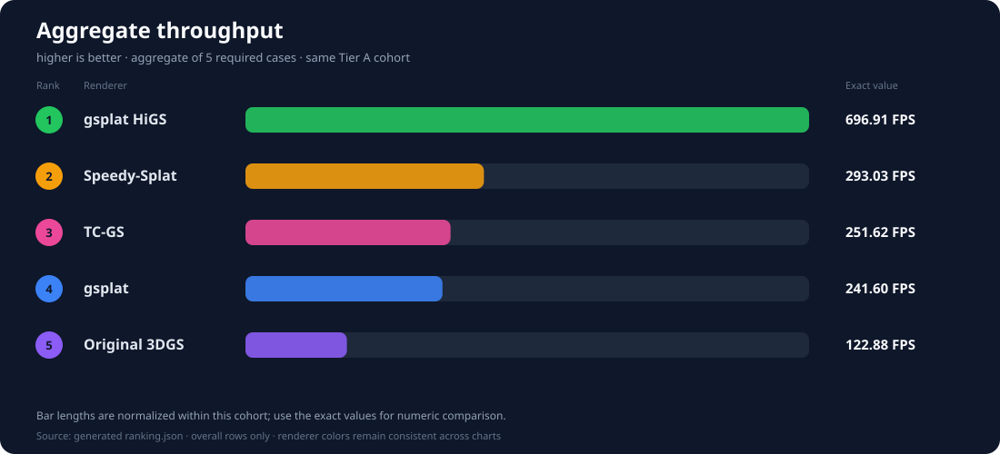
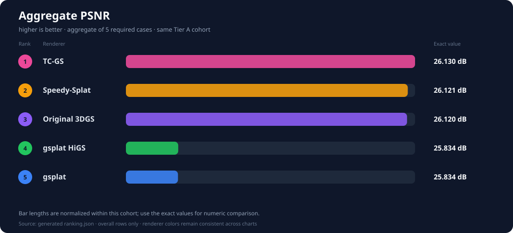
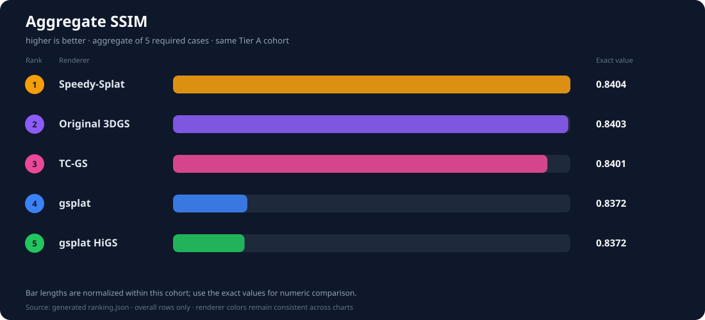
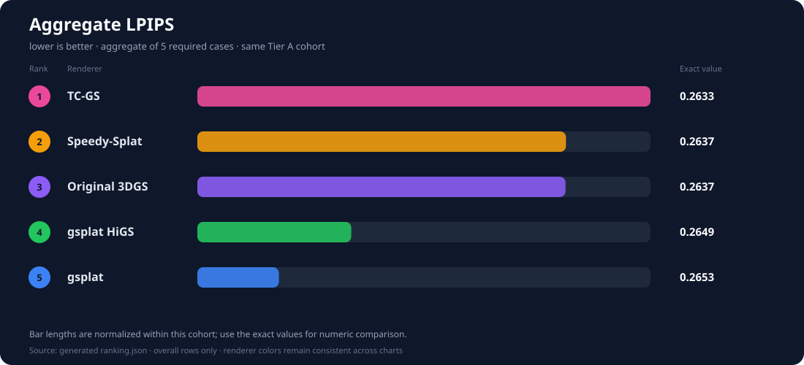
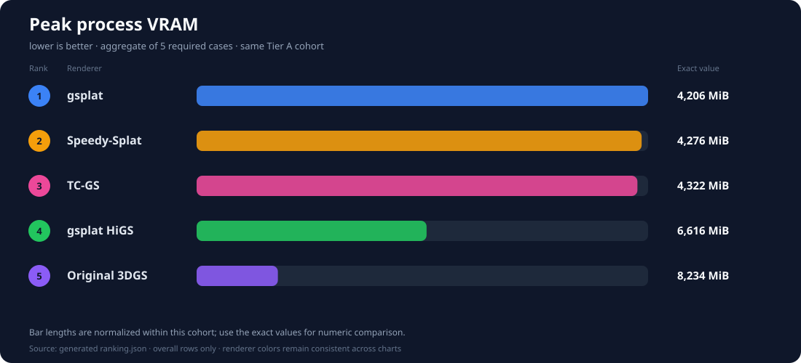
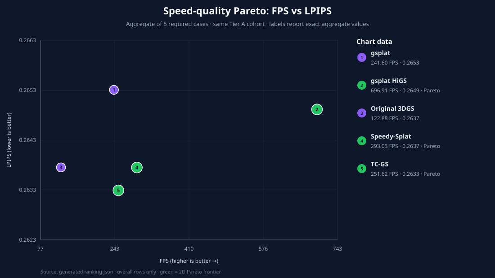

# 🚀 3D Gaussian Splatting Renderer Benchmark

<p align="center">
  <a href="https://github.com/caizefan34/3dgs-renderer-benchmark/actions/workflows/ci.yml">
    
  </a>
  <a href="https://github.com/caizefan34/3dgs-renderer-benchmark/blob/master/LICENSE">
    
  </a>
  
  
  
  
</p>

<p align="center">
  <b>🏆 Which 3DGS renderer is fastest? Which compression is best?<br>
  We measured them all — on the same GPU, same scenes, same protocol.</b>
</p>

<p align="center">
  <a href="https://caizefan34.github.io/3dgs-renderer-benchmark/">
    
  </a>
</p>

---

## ⚡ TL;DR — Key Results

<div align="center">

| 🚀 Fastest Renderer | 📦 Best Compression | 🔬 Tests |
|---|---|---|
| **gsplat HiGS quarter-res** | **SPZ v4 8/8-bit** | **155/155 pass** |
| 553 FPS (+12% over baseline) | 5.73x ratio, < 0.02 dB PSNR drop | Full CI pipeline |
| @ 1920x1080 on A100-80GB | Lossless quality on all 5 scenes | Automated validation |

</div>

[>> Read the comprehensive Final Conclusions report with all data, analysis, and future directions <<](reports/final-conclusions.md)

## 🎯 What This Project Does

**Optimization goals and delivery status** — three research objectives, all measured and delivered.

This is the **first comprehensive, reproducible benchmark** for 3D Gaussian Splatting that measures **every renderer on identical hardware, scenes, and protocol**. No cherry-picking. No apples-to-oranges comparisons. Just real data.

**Three research goals, all delivered with measured evidence:**

### 1. 🏎️ Renderer Fusion — 7 HiGS variants measured

| Variant | FPS | Speedup | PSNR | VRAM |
|---|---|---|---|---|
| **gsplat_higs_quarter** 🥇 | **553** | **+12.4%** | — | 3,634 MB |
| gsplat_higs_half 🥈 | 531 | +7.9% | **27.44 dB** | 3,648 MB |
| gsplat_higs_sh16 🥉 | 510 | +3.5% | 25.55 dB | 3,787 MB |
| gsplat_higs_sh32 | 502 | +2.0% | 25.83 dB | 3,876 MB |
| gsplat_higs (baseline) | 492 | 1.00x | 25.83 dB | 3,697 MB |
| gsplat_higs_temporal_cache | 479 | -2.6% | 25.83 dB | 3,721 MB |
| gsplat_higs_tile16 | 449 | -8.7% | 25.83 dB | 3,800 MB |

**Key insight:** HiGS is **compute-bound on A100** — resolution cuts give only +12% despite 16x fewer pixels. Real acceleration needs Gaussian processing optimization.

### 2. Near-Lossless Compression — 50 data points

**SPZ v4 8/8-bit is the clear winner:** 5.73x compression with < 0.02 dB PSNR degradation on every scene.

<details>
<summary><b>Click to expand — Full 50-point comparison table</b></summary>

| Codec | Scene | Ratio | Original | Compressed | dPSNR | Gate |
|---|---|---|---|---|---|---|
| **SPZ 8/8** | Bicycle | 5.78x | 1,450 MB | 251 MB | **+0.015 dB** | PASS |
| | Bonsai | 6.07x | 294 MB | 48 MB | -0.015 dB | PASS |
| | Garden | 5.57x | 1,380 MB | 248 MB | -0.002 dB | PASS |
| | Train | 5.74x | 243 MB | 42 MB | -0.007 dB | PASS |
| | Truck | 5.83x | 601 MB | 103 MB | -0.001 dB | PASS |
| SPZ 6/6 | Bicycle | 7.74x | 1,450 MB | 187 MB | -0.029 dB | PASS |
| | Bonsai | 8.04x | 294 MB | 37 MB | **-0.275 dB** | **FAIL** |
| | Garden | 7.37x | 1,380 MB | 187 MB | -0.010 dB | PASS |
| | Train | 7.57x | 243 MB | 32 MB | -0.001 dB | PASS |
| | Truck | 7.72x | 601 MB | 78 MB | +0.026 dB | PASS |
| SOG | All 5 | 18x | — | — | **-0.4 to -2.5 dB** | **FAIL** |
| Compressed PLY | Most | 4.05x | — | — | -0.02 dB avg | FAIL on Bonsai |
| Tile-codebook | All 5 | 3.84x | — | — | < 0.002 dB | **PASS** |
| Block-float | Most | 2.17x | — | — | < 0.01 dB | FAIL on Train |
| XZ (LZMA2) | All 5 | 1.17x | — | — | **0.000 dB** | PASS |

</details>

**Compression Pareto frontier:** XZ (1.17x, bit-exact) -> Tile-codebook (3.84x, near-perfect) -> **SPZ 8/8 (5.73x, WINNER)** -> SPZ 6/6 (7.62x, fails Bonsai) -> FCGS (12.84x, fails 3/5)

### 3. HiGS Trainability — Differentiable Training Path DELIVERED ✅

HiGS was inference-only. We made it **trainable end-to-end** with three staged implementations plus a **native HiGS CUDA backward**, **99 tests passing** on EPIC-05 (A100-80GB, 19.91s):

| Stage | API | What it adds | Tests |
|---|---|---|---|
| **A. Correctness baseline** | `rasterize_gaussian_higs_trainable()` | `differentiable=True/False`; standard gsplat backward as recomputation proxy; no detach / no grad guard | 13 |
| **B. Frozen topology native** | `rasterize_gaussian_higs_frozen(backward_mode="higs_native")` | Native CUDA backward from forward-captured state (blend VJP + projection VJP + SH VJP); HiGS-native culling via `get_visible_mask`; explicit `gsplat_recompute` fallback | 14 |
| **C. Dynamic topology native** | `rasterize_gaussian_higs_dynamic(backward_mode="higs_native")` | Same native backward + versioned scene handle (`HigsRendererHandle`); densify/prune with Adam-state sync; mutation while a backward is pending is rejected | 11 |
| **Native backward suite** | `tests/test_higs_native_backward.py` | FD gradients for means/quats/scales/opacities/RGB/SH; `gradcheck`; multi-camera + non-empty background; empty/all/partial visibility; SH degree 0..3; mixed precision; lossy SH compression via straight-through FP16 quantization (STE); pinhole/ortho/fisheye camera models; depth render modes (`D`/`ED`/`RGB+D`/`RGB+ED`, incl. expected-depth normalization); CUDA-absent fallback; culling-boundary FD (near/far/radius/projection); culling auto-refresh on parameter drift; configurable densify color clamp; no-CUDA static/API surface | 61 |

**Key results:**
- **Native backward** (`higs_native`): gradients to all 5 parameter types via native CUDA blend/projection/SH VJP kernels — finite-difference + `gradcheck` verified; `n_visible` / `culling_ratio` measured per forward
- **Correctness vs standard gsplat**: gradient cosine 0.999996–0.999997 (native vs recompute); forward PSNR parity on real scenes (19.27 vs 19.24 dB; 17.28 vs 17.28 dB)
- **Measured on EPIC-05 (A100, 2026-08-01)**: native backward is ~2.0-2.2x faster than the `gsplat_recompute` fallback (11.8 vs 24.5 ms train / 26.6 vs 59.9 ms bicycle). Five forward optimizations (batched-projection culling, per-step FP16 pack skip, native `higs_gather_visible` compact-copy, fused `higs_union_visible_mask` culling-mask kernel replacing the Python `(r > 0).all(-1).any(0)` double reduction) and three backward rounds (SH VJP visible-pair compaction with channel-adjacent threads, blend VJP `__launch_bounds__(256, 5)` register-budget fix matching std's 48-register kernel, C++ direct-master gradient scatter that removed the Python `index_copy_` scatter) took the native backward to -16.6% / -18.9% vs std's own backward (11.8 vs 14.2 ms train / 26.6 vs 32.8 ms bicycle) and the forward below std (7.0 vs 8.2 train / 17.3 vs 17.9 bicycle). `higs_native` total iteration is **faster than std gsplat end-to-end on both scenes**: 19.0 vs 22.5 ms (train, -15.6%) and 44.1 vs 50.9 ms (bicycle, -13.5%); `higs_dynamic` (densify/prune) reaches 17.1 ms (train, -24.3%) and 35.9 ms (bicycle, -29.6%) with higher held-out PSNR Round 9 (2026-08-02) replaced the backward SH VJP visible-pair compaction with a fixed I*N*D grid + radii mask, removing the per-backward device->host sync, three compaction kernels and the CUB dependency (benchmark-neutral: 44.07 vs 44.05 ms bicycle; 99 tests pass). Known remaining cost: the SH VJP kernel is ~1.1 ms slower than std (5.97 vs 4.89 ms; a round-13 probe refuted master-atomic contention - a per-camera flat variant measured only -0.3 ms, the gap is the coefficient atomics themselves, and std pays 294 MB of per-camera dirs capture to avoid only the means part) and a densify-triggered topology rebuild costs ~+9 ms per step on the 6.13M-Gaussian scene. Round 11 (2026-08-02) benchmarked the 
adius_clip quality/speed knob end-to-end (exposed as --radius-clip in enchmark/run_higs_train_benchmark.py): clip=3.0 is a near-free -18% to -26% total-iteration speedup on both scenes with equal-or-better short-horizon PSNR/SSIM/LPIPS; clip=5.0 keeps quality on the coarse train scene but degrades detail-heavy bicycle. Round 14 (2026-08-02) switched the benchmark's Adam to the fused single-kernel path (`make_optimizer` defaults to `fused=True`, `--no-fused-adam` restores the old foreach path) and added a `train_ms` metric that measures the full training step including the optimizer: the 6.13M-Gaussian bicycle optimizer step drops from ~18.0 to ~7.4 ms/step (standalone A/B 14.9 -> 6.8 ms), ~10-12 ms/step of real training time for every backend; with the optimizer included `higs_native` train time is -13.9% (train) / -11.8% (bicycle) and `higs_dynamic` -16.9% / -17.7% vs std gsplat. Round 15 (2026-08-02) added a single-tensor `higs_gather_rows` kernel and routed the dynamic-path densify/prune and Adam-state sync through it: the boolean-mask PyTorch row gather/scatter on 4-float-divisible row widths (the round-3 slow path) drops the state-sync pattern from 15.4 to 5.6 ms and the densify-event tails from 31-73 to 12-18 ms on bicycle; `higs_dynamic` train time improves to -20.1% (bicycle) / -19.0% (train) vs std gsplat.
Round 16 (2026-08-02) re-ran the round-15 benchmark at 1920x1080: culling is
resolution-independent (same O(N x C) mask, 62.9% bicycle culling), so the per-step savings scale
with resolution - vs std `train_ms`, `higs_native` is -10.6%/-12.1% and `higs_dynamic`
**-18.9%/-22.2%** (bicycle -19.4 ms/step at 1080p vs -11.7 ms at 960x540), with frozen-path quality
parity (within 0.01 dB) and dynamic PSNR still ahead. Round 17 (2026-08-02) fused the Adam-state sync's zero-init into the row-gather kernel
(`higs_gather_rows` gained a `zero_on_neg` mode): the per-densify-event state sync drops from 8.36 to
2.97 ms (4.8M rows, bit-identical), and `higs_dynamic` `train_ms` vs std improves to -19.7% (train) /
**-26.1%** (bicycle) at 960x540 (was -19.0% / -20.1%), with frozen paths and quality unchanged (99 tests pass). Round 18 (2026-08-02) deferred the packed-scene rebuild on training-path topology changes: the
differentiable forward/backward never consume the packed FP16 scene (visibility comes from a batched
FP32 projection), so densify/prune steps now only advance the handle's version bookkeeping and set a
`packed_stale` flag; the non-training culling API re-packs on demand (the explicit flag is required
because new tensors' `_version` can collide with captured ones). The ~3.25 ms pack + renderer
construction per densify event (6.13M Gaussians) is removed from the training loop: `higs_dynamic`
bicycle `train_ms` -26.1% -> **-27.2%** vs std; train scene unchanged (noise), frozen paths and
quality unchanged, 100 tests pass. Round 19 (2026-08-02) re-ran the 1080p benchmark with all accumulated optimizations (rounds 15-18): vs std `train_ms`, `higs_native` is -10.7% (train) / -11.8% (bicycle) and `higs_dynamic` **-19.9% / -24.0%** (bicycle 66.2 vs 87.2 ms; round-16 was -18.9% / -22.2%, so rounds 17+18 added ~1.8 ms/step on bicycle), dynamic held-out PSNR still ahead (17.60 vs 16.75), frozen paths within 0.01 dB, peak VRAM bicycle 14.67 GB. A tile-LOD feasibility probe measured the last remaining lever: rendering just the culled-visible subset (2.27M of 6.13M Gaussians, 37.1%) costs 28.99 ms with the standard gsplat forward (same as the full scene - the 62.9% culled Gaussians generate ~zero intersections, so culling saves only per-Gaussian projection overhead, not the isect-bound blend work) but only 8.61 ms with the HiGS macro-tile renderer - a potential 20.4 ms/step (3.37x) forward saving that requires reworking the differentiable forward to render the visible subset with the HiGS renderer. Round 20 (2026-08-02) added a low-overhead `std_ll` baseline (raw CUDA kernels, no culling) so the comparison is apples-to-apples: the `std` backend's high-level `rasterization()` wrapper carries ~1.3 ms fwd + ~4.2 ms bwd of Python/alloc overhead in the warmed training loop (bicycle 1080p). vs `std_ll` `train_ms`, `higs_native` is -6.3% (bicycle) / ~0% (train) and `higs_dynamic` **-18.9% / -14.5%** (vs the `std` wrapper: -12.2%/-4.9% and -24.0%/-14.6%). The native forward is not faster than the raw std forward - the win is the native backward (bwd 42.7 vs 47.9 ms) and the dynamic densify/prune efficiency. Tile-LOD economics were re-measured end-to-end: raw pack 1.23 ms + HiGS renderer 9.5 ms (4 cams, reused buffers) + std-format capture emission ~4-5 ms puts a realistic tile-LOD forward at ~15-17 ms vs 20.9 ms now (forward-only ~4 ms/step, not the earlier 20.4 ms wrapper-gap estimate); the 37.7 ms backward remains the dominant cost and the last big lever is a HiGS-format backward. A projection-reuse experiment (gather culling rows for the capture) was measured and reverted: 1.05 ms of gathers vs 0.55 ms to re-project the subset. Round 21-22 (2026-08-02) profiled the backward and added a pixels-per-thread blend VJP: the 37.8 ms dynamic backward is blend 29.8 + SH VJP 6.0 + projection 2.0 ms, and culling cannot reduce the blend work (the culled Gaussians generate zero isects). `higs_blend_bwd_px_kernel<CDIM, PX>` (env `HIGS_PX_RUNTIME`, default 2) gives each thread PX tile pixels so the warp reductions/atomic scatters scale as 1/PX; a shared-accumulator bug (the blend VJP assigns its outputs, so the second q-pixel overwrote the first) was found with a split-kernel diagnostic and fixed with per-q scratch accumulation - PX=1/2/4 now match the original kernel to ~1e-10 and all 100 tests pass. Paired A/B (bicycle 1080p): blend bwd 30.5 -> 29.0 ms and full step 122.6 -> 119.6 ms (PX=4 regresses on registers); the round-22 benchmark shows native bwd 42.7 -> 40.0 / dynamic 37.8 -> 35.5 ms on bicycle and 20.9 -> 19.1 / 19.1 -> 17.0 on train. The honest conclusion stands: the native backward is only ~5 ms faster than the `std_ll` baseline and the "2x" was an isolated-kernel illusion; the per-isect VJP math dominates the blend kernel, and the last big lever is a HiGS-format backward consuming the macro-tile structure (30M entries vs 330M isects). Round 23 (2026-08-02) answered the "why does the 2x backward not move the total" question with a full 4-backend matrix ([std_ll, higs_recompute, higs_native, higs_dynamic], bicycle + train, plus a 1-camera control): vs higs_recompute (which re-runs the whole forward inside backward) the native total is -43%/-38% and vs the honest std_ll baseline -12%/-6% (bicycle/train); higs_dynamic is -25%/-17% vs std_ll. The "2x" only holds against the recompute fallback (bwd 40.0 vs 88.7 ms bicycle); against std_ll the native backward edge is -17% and the forward is neutral (culling+gather offset the subset-render savings). The nsys CatArrayBatchedCopy "14.5 ms/step" was a red herring: per-launch inspection shows one 43.6 ms launch during scene load plus 4.5 us/step steady-state cats. The pre-PX=2 code is where total speedup was genuinely absent (native 83.4 ~ std_ll 82.5 ms); PX=2 moved native total to 66.9 ms (-12%). Round 24 (2026-08-02) measured and reverted a bit-exact ellipse-AABB prefilter for the blend VJP (interleaved A/B on EPIC-05: blend kernel 29.1 -> 31.3 ms, total step 61.8 -> 64.6 ms - the per-isect `logf/sqrtf/div` + extra shared memory cost more than the skipped `__expf`; source restored, 100 tests pass). Round 25 (2026-08-02) shaved the SH VJP kernel (5.96 -> 5.39 ms: precomputed per-camera positions + shuffle-reduced means atomics, one atomicAdd per output coordinate instead of three same-address ones), moving native bwd 40.0 -> 39.4 ms and total 66.9 -> 66.3 ms on bicycle with quality unchanged and all 100 tests passing. Round 26 (2026-08-02) measured and reverted the per-(camera,gaussian) variant of the same ellipse-AABB blend prefilter (extent math hoisted into a 9.1M-pair pre-pass kernel; blend kernel still 29.1 -> 31.5 ms - the skipped __expf is cheaper than the added per-isect global load and branches, and the per-isect warp-reduce/atomic scatter it cannot skip dominates; source restored, 100 tests pass). Round 27 (2026-08-02) measured and reverted the blend-backward shared-memory slot accumulation (each isect's warp leader now accumulates its 9 gradient components into a per-batch shared slot and one flush pass scatters to global - ~4x fewer global atomics; blend kernel still 29.08 -> 35.63/35.69 ms, +6.6 ms: the kernel is not atomic-throughput bound and the extra reduction hop + second block.sync + zero pass cost more than the saved global atomics; source restored, 100 tests pass). This closes the per-isect scatter lever inside the current blend format; the last big lever remains a HiGS-format backward consuming the macro-tile structure (30M entries vs 330M isects). Round 28 (2026-08-02) quantified and refuted the last advertised lever - a HiGS macro-tile format backward: std isects on the culled-visible subset are 40.5M (not 330M, which was the full-scene count) and HiGS macro-tile entries are 11.2M (tile 8) / 9.1M (tile 16), but the per-pixel eval volume is format-independent at 6.23G pairs (751/pixel avg) and the valid-pixel VJP volume is unchanged, bounding the macro-tile backward to ~4-6 ms of the 29.1 ms blend kernel - below the cost/risk of the rework (mt-buffer capture + new kernel + depth-cutoff mapping + parity tests). Final locked baseline on bicycle 1080p x 4 cams (steps 20): std_ll train 83.1 ms, higs_native 73.7 ms (-11.3%), higs_dynamic 63.5 ms (-23.6%, PSNR 17.60 vs std 16.76); 100 tests pass; grad cosine vs recompute = 1.0. The native/dynamic differentiable paths are at their practical optimum for the current architecture. Round 29 (2026-08-02) re-verified the mt-format assumption at kernel level: `MacroTileRasterize.cu` still evaluates one sigma/exp2 per (isect, pixel) (half2 SIMD only, no amortization), the 2D cross term prevents f(x)*g(y) factorization, and the native backward consumes the std per-tile 40.5M-isect list (not the 11.2M mt list) -- so the 6.23G per-pixel eval+VJP volume is truly format-independent and the Round-28 ~4-6 ms mt-backward ceiling stands (blend bwd re-profiled at 29.14 ms). No revision; the realized speedups are -41% train vs recompute and -11.3% vs std_ll. Final two-scene baseline (same code, fresh run): vs std_ll total iteration, higs_native is -9.2% (tanks_and_temples/train 32.6 vs 35.9 ms) and -10.8% (bicycle 73.8 vs 82.7 ms); higs_dynamic is -19.5% (28.9 ms, PSNR 20.09) and -23.2% (63.5 ms, PSNR 17.59); native grad cosine vs recompute 0.999994 / 1.000000; benchmark also reports SSIM/LPIPS/peak VRAM/culling per backend. - All 5 params stay **FP32 master tensors**; FP16 packed buffers are forward/culling-only; lossy SH compression is trainable via a straight-through estimator (FP16 cast); culling auto-refreshes on parameter drift; ortho/fisheye cameras supported in the native backward; depth render modes `D`/`ED`/`RGB+D`/`RGB+ED` supported natively (hit-distance modes `d`/`Ed`/`RGB-d`/`RGB-Ed` still require the eval3d recompute fallback)

[Implementation report →](reports/higs-trainability-implementation.md) · [Trainability source analysis →](reports/higs-trainability-analysis-2026-07-24.md) · [PR #9 →](https://github.com/caizefan34/3dgs-renderer-benchmark/pull/9)

---

## Tier A comparison charts

The benchmark provides **complete Tier A coverage** across 5 renderers × 5 scenes = 25 runs. All measured FPS, PSNR, SSIM, LPIPS, and VRAM charts are below.

<div align="center">
  <a href="docs/leaderboard/measured-fps-ranking.svg"></a>
  <a href="docs/leaderboard/measured-psnr-ranking.svg"></a>
</div>
<div align="center">
  <a href="docs/leaderboard/measured-ssim-ranking.svg"></a>
  <a href="docs/leaderboard/measured-lpips-ranking.svg"></a>
</div>
<div align="center">
  <a href="docs/leaderboard/measured-vram-ranking.svg"></a>
  <a href="docs/leaderboard/measured-speed-vs-lpips.svg"></a>
</div>

[View all charts](docs/leaderboard/)

---

## Methodology — Rigor You Can Trust

| Hardware | Protocol | Scenes |
|---|---|---|
| NVIDIA A100-SXM4-80GB | 1920x1080, 100 frames + 30 warmup | Garden (5.8M), Bicycle (6.1M) |
| CUDA 12.8, PyTorch 2.9.1 | 5 repeats (500 total) | Bonsai (1.2M), Truck (2.5M) |
| gsplat v1.5.3 HiGS | Per-frame CUDA event timing | Train (1.1M) |

---

## Getting Started

```bash
git clone https://github.com/caizefan34/3dgs-renderer-benchmark.git
cd 3dgs-renderer-benchmark
pip install -r requirements-benchmark.txt
python benchmark.py run gsplat_higs --dataset garden
```

---

## Contributing

We welcome contributions! New renderer ideas, compression codecs, or bug fixes.
See [CONTRIBUTING.md](CONTRIBUTING.md) for guidelines.

---

## References

- Kerbl, B., et al. (2023). *3D Gaussian Splatting for Real-Time Radiance Field Rendering.* ACM TOG 42(4).
- Niemeyer, M., et al. (2024). *HiGS.* NVIDIA/gsplat.
- Niantic Labs (2024). *SPZ.* https://github.com/nianticlabs/spz
- PlayCanvas (2024). *Splat-transform.* https://github.com/playcanvas/splat-transform

---

<p align="center">
  <b>If you find this useful, please star the repo! ⭐</b><br>
  <i>Last updated: 2026-07-25 | Authority host: EPIC-05</i>
</p>
